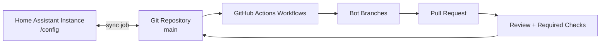

# HA Git Sync

Git-backed, security-first sync automation for Home Assistant configuration with safe defaults and reproducible recovery.

[](https://github.com/bronsonacoutts/ha-git-sync/actions/workflows/ci.yml) [](https://github.com/bronsonacoutts/ha-git-sync/actions/workflows/codeql.yml) [](LICENSE) [](https://github.com/bronsonacoutts/ha-git-sync/generate)

**Who this is for:** Home Assistant users who want reliable config history, predictable rollback, and low-maintenance GitHub Actions automation.

## What this solves

Home Assistant config changes are easy to lose track of when edits happen from multiple places (UI, YAML, scripts, backups). This project helps reduce:

- **Config drift:** keeps HA and GitHub in sync on a schedule and on key events.
- **Rollback risk:** keeps commit history and backup tags to recover quickly.
- **Audit gaps:** gives a clear change trail in commits and pull requests.
- **Reproducibility issues:** standardizes sync jobs, scripts, and repository layout.

## Key features

- **Bi-directional sync model:** pull from GitHub and push local HA updates.
- **GitHub Actions automation:** optional update PRs and automation alias correction.
- **Security guardrails:** hooks, safe defaults, and documented token/secret handling.
- **Template-based onboarding:** ready-to-merge examples for existing HA instances.

## Architecture



How to read this: local HA changes and repo changes converge through sync jobs; automation workflows raise PRs for human review before mainline updates are merged.

## Quick Start (5 minutes)

1. **Prerequisites**
   - Home Assistant with shell access to `/config`.
   - GitHub repository (private recommended for most users).
   - Git auth configured (SSH key or fine-grained token).
2. **Use template**
   - Click **Use this template** and create your own repository.
   - Clone to HA host: `git clone git@github.com:<your-user>/<your-repo>.git /config`.
3. **Configure secrets and permissions**
   - Follow [docs/git-setup.md](docs/git-setup.md).
   - Keep credentials in secure HA secrets paths; never hardcode in tracked files.
4. **Enable workflows**
   - Optional upstream sync (`.github/workflows/upstream-sync.yml`): create `.github/upstream-sync.enabled`.
   - Optional alias autocorrect: create `.github/automation-alias-autocorrect.enabled`.
5. **Run first sync safely**
   - Run `scripts/git_status.sh`, then `scripts/git_sync.sh` from `/config`.
6. **Verify checks pass**
   - In GitHub, confirm `CI / shellcheck`, `CI / yamllint`, and `CodeQL` are green.

> [!TIP]
> Start in a private test repository first, then mirror settings into production.

## Security model

### Least privilege token/scopes

- Prefer **SSH deploy keys** or fine-grained tokens scoped to one repo.
- For automation, use the default `GITHUB_TOKEN` where possible.
- Avoid broad classic PATs with full `repo` scope unless absolutely required.

### Secret handling and redaction

- Put secrets in Home Assistant `secrets.yaml` and GitHub Secrets.
- Treat logs as potentially sensitive; redact tokens, URLs with credentials, and hostnames when sharing.
- Rotate credentials after accidental exposure.

### Never commit

- `.env`, token files, private keys, backups with credentials.
- Home Assistant secrets, long-lived access tokens, or plaintext passwords.

### Incident response quick steps

1. Revoke/rotate exposed tokens or keys immediately.
2. Remove secrets from Git history if needed.
3. Review GitHub security alerts and audit log events.
4. Re-run sync job after validation.

> [!WARNING]
> Sync scripts should not be used as a secret management system; store secrets outside tracked config whenever possible.

## Repository protection expectations

Recommended protections for `main`:

- Require pull request before merge.
- Require at least one review (or maintainer self-review policy).
- Require status checks: `CI / shellcheck`, `CI / yamllint`, `CodeQL`.
- Block force pushes and branch deletion.
- Enable Dependabot alerts, secret scanning, and push protection.

## Operations runbook (concise)

- **Normal day-to-day flow:** edit HA config, run or wait for sync job, verify clean status.
- **Recovery after failed sync:** inspect `git status`, resolve file issues, rerun `scripts/git_sync.sh`.
- **Conflict resolution:** run pull, resolve conflicts locally in `/config`, commit with clear message, push.
- **Safe rollback:** identify known-good commit/tag, checkout in a staging copy, validate HA startup, then apply.

Full runbook: [docs/operations.md](docs/operations.md)

## Conflict policy (important)

This project uses `git merge -X ours` in sync scripts. In merge conflicts, **local Home Assistant `/config` changes win** over incoming `origin/main` changes.

- **What wins:** local tracked files on conflict (`-X ours`).
- **Why:** prevent unattended sync jobs from overwriting active local HA edits.
- **How to audit overrides:**

```bash
# Show what changed since remote main
git diff --name-status origin/main..HEAD

# Inspect one file's effective result
git diff origin/main..HEAD -- path/to/file.yaml

# Review merge commits created by sync jobs
git log --merges --oneline -20
```

If your source-of-truth is GitHub instead of local HA, do **not** use the default scripts unchanged.

## HA notifications auth

Script notifications to Home Assistant use one of these tokens when available:

- `SUPERVISOR_TOKEN` (preferred in supervised/add-on contexts)
- `HA_NOTIFY_TOKEN` (manual fallback for other environments)

Without either token, notification calls are skipped as best-effort and never block git operations.

## Troubleshooting

1. **Permission denied (publickey)** → verify SSH key loaded and repo access granted.
2. **Workflow not running** → ensure Actions enabled and optional `.enabled` file exists.
3. **No PR created by optional workflow** → likely no changes detected; check workflow summary.
4. **Merge conflict during upstream sync** → merge upstream into `main` manually, then rerun.
5. **Shell script exits early** → run with `bash -x` to find failing command.
6. **Detached HEAD in `/config`** → checkout `main` and pull latest.
7. **Hooks not active** → rerun `scripts/install_git_hooks.sh`.
8. **Unexpected file deletions staged** → review `.gitignore` and local cleanup scripts.
9. **Token auth failing** → confirm token expiration/scopes and remote URL format.
10. **HA restart errors after sync** → validate YAML and restore known-good commit.

Detailed symptom index: [docs/troubleshooting.md](docs/troubleshooting.md)

## FAQ

**Will this overwrite my Home Assistant config?**  
It syncs tracked files and may merge remote changes; review diffs and use PR checks before broad rollout.

**Can I use a private repo?**  
Yes, private repositories are supported and recommended.

**Does this work with UI-managed Home Assistant changes?**  
Yes; UI changes are written to files under `/config`, then picked up by sync jobs.

**Can I run this for multiple HA instances?**  
Yes, but keep one repo/branch strategy per instance to avoid accidental cross-overwrites.

See full FAQ: [docs/faq.md](docs/faq.md)

## Contributing, security, support, license

- Contribution guide: [CONTRIBUTING.md](CONTRIBUTING.md)
- Security policy: [SECURITY.md](SECURITY.md)
- Support channels: [SUPPORT.md](SUPPORT.md)
- Code of Conduct: [CODE_OF_CONDUCT.md](CODE_OF_CONDUCT.md)
- License: [LICENSE](LICENSE)

## Launch alignment (GitHub UI)

Apply these repository settings in GitHub UI before public launch:

1. **Visibility**
   - Go to **Settings → General → Danger Zone → Change repository visibility**.
   - Use **Public** only when secrets are confirmed clean and branch protection is enabled.
2. **Topics**
   - Go to repository home → **About (gear icon) → Topics**.
   - Suggested: `home-assistant`, `automation`, `gitops`, `github-actions`, `yaml`.
3. **Discussions**
   - Go to **Settings → General → Features**.
   - Enable **Discussions** to match support routing in [SUPPORT.md](SUPPORT.md).
4. **Homepage/forum link**
   - Go to repository home → **About (gear icon) → Website**.
   - Add a forum thread URL after publishing content from [docs/forum-post.md](docs/forum-post.md).
