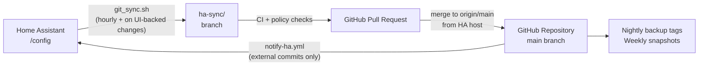

# HA Git Sync

Set-and-forget, bidirectional Git sync for Home Assistant configuration — automatic backups, conflict resolution, and version history with near-zero user interaction after setup.

[](https://github.com/bronsonacoutts/ha-git-sync/actions/workflows/ci.yml) [](https://github.com/bronsonacoutts/ha-git-sync/actions/workflows/codeql.yml) [](LICENSE) [](https://github.com/bronsonacoutts/ha-git-sync/generate)

## What is this?

HA Git Sync is a collection of shell scripts, Home Assistant automations, and configuration examples that keep your Home Assistant `/config` directory automatically synchronized with a GitHub repository. Once installed, it runs unattended — committing local changes, pulling remote updates, resolving merge conflicts, creating backups, and cleaning up old snapshots — all without user intervention.

**Who this is for:** Home Assistant users who want automatic config version control, reliable rollback, and a full change audit trail without manually running git commands.

## What this repo contains

```
scripts/                    # Core sync engine (bash)
├── git_runtime.sh          #   Shared library: config, locking, retry, notifications
├── git_sync.sh             #   Full reconcile: pull, publish PR, merge, fast-forward
├── git_pull.sh             #   Fetch and merge only (no push)
├── git_push.sh             #   Commit, reconcile, PR, and merge from the HA host
├── git_status.sh           #   Show git status of config directory
├── git_nightly_backup.sh   #   Sync + create dated backup tag
├── git_weekly_snapshot.sh  #   Create tar.gz snapshot + immutable weekly tag
├── git_cleanup_backups.sh  #   Prune backup tags older than N days
├── github_pr_sync.py       #   GitHub API helper for HA-hosted PR create/wait/merge
├── install_git_hooks.sh    #   Install commit-msg and pre-push hooks
├── git-to-ha.sh            #   Compatibility wrapper → git_pull.sh
├── ha-to-git.sh            #   Compatibility wrapper → git_push.sh
├── git_hooks/              #   Git hook scripts
│   ├── commit-msg          #     Reject empty/placeholder commit messages
│   └── pre-push            #     Block accidental direct pushes to main
├── validate_automations.py #   Validate automation IDs and paths
├── migrate_automations.py  #   Add deterministic IDs to existing automations
├── fix_automation_aliases.py   # Optional: normalize automation alias format
├── fix_automation_aliases.sh   # Shell wrapper for alias fixer
└── migrate_automations.sh  #   Shell wrapper for migration script

automations/                # Ready-to-use HA automations
└── meta_git.yaml           #   Hourly sync, push-on-UI-change, nightly backup,
                            #   weekly snapshot, webhook pull

configuration.yaml.example  # HA config snippet (shell commands + automation include)
scripts.yaml.example        # HA scripts with debounced push (3-min quiet window)
automations.yaml.example    # Alternative: inline automations format
.gitignore                  # Excludes secrets, databases, logs, caches
.gitignore.example          # Template for users to copy into their own repos

docs/                       # Setup guides, operations runbook, troubleshooting
tests/                      # Pytest suite for Python validation/migration scripts
hooks/                      # Post-merge template + sync lifecycle extension hooks
examples/                   # Additional example configurations
```

## How it works


```mermaid
flowchart LR
    A["Home Assistant\n/config"] -->|"git_sync.sh\n(hourly + on UI-backed changes)"| B["ha-sync/<host>\nbranch"]
    B -->|"CI + policy checks"| C["GitHub Pull Request"]
    C -->|"merge to origin/main\nfrom HA host"| D["GitHub Repository\nmain branch"]
    D -->|"notify-ha.yml\n(external commits only)"| A
    D --> E["Nightly backup tags\nWeekly snapshots"]
```

**Sync cycle:**
1. **Local changes detected** → `git add -A` + commit with timestamp
2. **Fetch remote** → `git fetch origin main`
3. **Merge** → `git merge -X ours` (local HA changes always win conflicts)
4. **Publish from HA** → push `ha-sync/<host>` branch, open/update PR, wait for CI, merge to `origin/main`
5. **Fast-forward local main** → HA updates itself to the GitHub merge commit
6. **Notify** → optional Home Assistant notification on failure only

**Concurrency safety:** All operations acquire a directory-based lock (`.git/ha-git-sync.lock`) before touching git. Stale locks are auto-removed after 10 minutes. Only one sync job runs at a time.

**Conflict resolution:** Fully automatic. The `-X ours` merge strategy means your local Home Assistant edits always take priority over remote changes on line-level conflicts. Non-conflicting remote changes merge cleanly. No manual intervention required.

## What it does NOT do

- **Not a secret manager.** Secrets must stay in `secrets.yaml` (gitignored) or GitHub Secrets. This project never handles, stores, or syncs credentials.
- **Not a full backup solution.** Weekly snapshots contain config YAML only — the HA database (`home-assistant_v2.db`), add-on data, and media files are excluded. Use HA's built-in backup system for full disaster recovery.
- **Not a CI/CD pipeline.** It syncs files bidirectionally. It does not deploy, test, or validate your HA configuration before applying it.
- **Not a multi-instance orchestrator.** Each HA instance needs its own repository. Cross-instance config is out of scope.
- **Does not auto-rotate credentials.** SSH keys and GitHub tokens must be renewed manually when they expire.
- **Does not guarantee local lint tooling is installed.** Policy and lint checks run in GitHub before HA-originated sync PRs merge to `main`, but optional local hook checks are still your responsibility.
- **Does not work without shell access.** Requires `bash`, `git`, and `curl` on the HA host.

## Installation

### Prerequisites

- Home Assistant with shell/terminal access to `/config`
- `git`, `bash`, and `curl` installed on the HA host
- A GitHub repository (private recommended)
- Git authentication configured (SSH key or fine-grained PAT) — see [docs/git-setup.md](docs/git-setup.md)

### Step 1: Create your repository

Click **[Use this template](https://github.com/bronsonacoutts/ha-git-sync/generate)** to create your own copy, then clone it:

```bash
git clone git@github.com:<your-user>/<your-repo>.git /config
cd /config
```

Or, to add to an existing HA config repo, copy the `scripts/` directory and example files manually.

### Step 2: Configure Home Assistant

Merge the contents of these example files into your existing HA config:

| Example file | What to add | Where |
|---|---|---|
| `configuration.yaml.example` | `automation:` include + `shell_command:` block | `/config/configuration.yaml` |
| `scripts.yaml.example` | HA script definitions (sync, push, status) | `/config/scripts.yaml` |

> [!IMPORTANT]
> You **must** add `automation: !include_dir_merge_list automations/` to your `configuration.yaml`. Without this, HA cannot load automations from the `automations/` directory or write UI edits back to tracked files.

### Step 3: Set up authentication

Follow [docs/git-setup.md](docs/git-setup.md) for SSH or HTTPS+PAT setup.

If you keep the default `GITHUB_SYNC_MODE=pull-request`, also expose a GitHub
API token on the HA host as `GITHUB_API_TOKEN` or `GH_TOKEN`. The HA box uses
that token to create, monitor, and merge the sync PR after it pushes the
`ha-sync/<host>` branch.

### Step 4: Configure the webhook (optional but recommended)

For near-real-time sync when changes are pushed to GitHub from other sources:

1. Generate a webhook secret:
   ```bash
   python3 -c "import secrets; print(secrets.token_urlsafe(32))"
   ```
2. Add to `/config/secrets.yaml`:
   ```yaml
   git_sync_webhook_id: "your-generated-secret-here"
   ```
3. Add `HA_WEBHOOK_URL` as a GitHub Actions secret:
   ```
   https://<your-ha-url>/api/webhook/<git_sync_webhook_id>
   ```

### Step 5: Install git hooks (optional)

```bash
bash scripts/install_git_hooks.sh
```

### Step 6: Migrate existing automations (first install only)

If you have existing automations without `id` fields:

```bash
python3 scripts/migrate_automations.py /config
python3 scripts/validate_automations.py /config   # verify
```

### Step 7: First sync

```bash
bash scripts/git_status.sh    # check current state
bash scripts/git_sync.sh      # run first sync
```

Reload automations in HA (Developer Tools → YAML → Automations), then verify the sync automations appear and are enabled.

## Configuration

All scripts read configuration from environment variables with sensible defaults:

| Variable | Default | Description |
|---|---|---|
| `HA_CONFIG_DIR` | `/config` | Path to Home Assistant config directory |
| `GIT_BRANCH` | `main` | Branch to sync with |
| `GIT_USER_NAME` | `ha-git-sync` | Git commit author name |
| `GIT_USER_EMAIL` | `ha-git-sync@localhost` | Git commit author email |
| `HA_NOTIFY_URL` | *(empty — disabled)* | HA webhook URL for failure notifications |
| `GITHUB_SYNC_MODE` | `pull-request` | `pull-request` keeps PR checks/policies in front of `main`; `direct` preserves legacy push-to-main behavior |
| `GITHUB_API_TOKEN` | *(empty)* | Required in `pull-request` mode so the HA host can create/update/merge sync PRs |
| `GITHUB_SYNC_BRANCH_PREFIX` | `ha-sync` | Prefix for HA-hosted sync branches |
| `GITHUB_SYNC_MARKER` | `[ha-sync]` | Commit/PR marker used to suppress webhook pull-backs on HA-originated merges |
| `GITHUB_SYNC_POLL_INTERVAL_SEC` | `15` | Seconds between GitHub PR state checks |
| `GITHUB_SYNC_POLL_TIMEOUT_SEC` | `900` | Max seconds to wait for checks/rules before failing the HA-hosted publish |
| `GIT_SYNC_LOCK_WAIT_SEC` | `180` | Max seconds to wait for sync lock |
| `GIT_SYNC_LOCK_STALE_SEC` | `600` | Seconds before a lock is considered stale |

Set these in your HA shell environment or in the shell command definitions.

## Built-in automations

The included `automations/meta_git.yaml` provides:

| Automation | Trigger | What it does |
|---|---|---|
| Hourly sync | Every hour at :00 | Full HA-hosted reconcile and publish |
| Publish on UI-backed change | `lovelace_updated` plus UI-initiated YAML reload events | Debounced publish (3-min quiet window via script) |
| Reload after sync/pull | Sync or pull script completes | Reloads YAML-managed config after GitHub-originated changes land locally |
| Pre-edit sync | `input_boolean.maintenance_major_changes` on | Sync before making big changes |
| Nightly backup | 03:00 daily | Sync + create `backup/nightly-YYYY-MM-DD` tag |
| Weekly snapshot | 02:30 Sunday | Create tar.gz archive + immutable `snapshot/weekly-YYYY.WW` tag |
| Webhook pull | GitHub webhook POST | Pull latest when GitHub notifies of an external push to `main` |

## Extension hooks

Home Assistant-hosted sync jobs can run local extension hooks from `hooks/`:

- `hooks/pre-gh-to-ha.d/` before GitHub changes are applied locally
- `hooks/post-gh-to-ha.d/` after GitHub changes are applied locally
- `hooks/pre-ha-to-gh.d/` before HA changes are published back to GitHub
- `hooks/post-ha-to-gh.d/` after the HA-hosted publish merges to `origin/main`

See [hooks/README.md](hooks/README.md) for usage and guardrails.

## Conflict policy

All sync scripts use `git merge -X ours`. In merge conflicts, **local Home Assistant `/config` changes always win** over incoming remote changes.

- **What wins:** local tracked files on line-level conflict.
- **Why:** prevents unattended sync from overwriting active HA edits.
- **Non-conflicting changes:** merge cleanly from remote.
- **To audit:** `git log --merges --oneline -20` or `git diff origin/main..HEAD`.

> [!NOTE]
> If your source-of-truth is GitHub (not HA), do not use these scripts unchanged.

## Automation ID policy

Every automation **must** have a stable, unique `id` field for HA UI editing to work. The included `validate_automations.py` enforces this in CI and locally:

```bash
python3 scripts/validate_automations.py /config
```

Use 13-digit Unix millisecond timestamps (e.g., `'1767772677262'`). Run `migrate_automations.py` once to add IDs to existing automations.

## Security model

- **Least-privilege credentials:** Use SSH deploy keys or fine-grained PATs scoped to one repo.
- **Secrets stay gitignored:** `secrets.yaml`, `.ssh/`, `.env`, credentials are all in `.gitignore`.
- **Webhook authentication:** Webhook IDs use `!secret` indirection — never hardcoded.
- **Git hooks:** Block accidental commits of placeholder messages and direct pushes to `main`.
- **Notifications:** Optional, best-effort. Failure notifications via HA webhook; no secrets in payloads.

See [docs/security.md](docs/security.md) and [SECURITY.md](SECURITY.md) for full details.

## Troubleshooting

| Symptom | Fix |
|---|---|
| Permission denied (publickey) | Verify SSH key is loaded and has repo access |
| Sync script exits early | Run with `bash -x scripts/git_sync.sh` to find the failing command |
| Detached HEAD in `/config` | `git checkout main && git pull` |
| Hooks not active | Rerun `bash scripts/install_git_hooks.sh` |
| Lock timeout | Check for zombie git processes; lock auto-clears after 10 min |
| Token auth failing | Confirm token expiration/scopes and remote URL format |
| HA errors after sync | Validate YAML; restore known-good commit with `git checkout <hash> -- path/to/file` |

Full symptom index: [docs/troubleshooting.md](docs/troubleshooting.md)

## Documentation

| Document | Contents |
|---|---|
| [docs/quickstart.md](docs/quickstart.md) | Step-by-step first-time setup |
| [docs/git-setup.md](docs/git-setup.md) | SSH and HTTPS auth configuration |
| [docs/git-sync-quickstart.md](docs/git-sync-quickstart.md) | Integration into existing HA repos |
| [docs/prerequisites.md](docs/prerequisites.md) | Detailed dependency and auth requirements |
| [docs/operations.md](docs/operations.md) | Day-to-day operations and recovery runbook |
| [docs/security.md](docs/security.md) | Security guidance and credential handling |
| [docs/troubleshooting.md](docs/troubleshooting.md) | Symptom-based troubleshooting index |
| [docs/faq.md](docs/faq.md) | Frequently asked questions |

## FAQ

**Will this overwrite my Home Assistant config?**
Sync merges tracked files. Local HA edits always win on conflicts. Non-conflicting remote changes are merged in.

**Can I use a private repo?**
Yes — private repositories are recommended.

**Does this work with UI-managed automations?**
Yes, if (1) your `configuration.yaml` includes `automation: !include_dir_merge_list automations/` and (2) every automation has a unique `id` field.

**Can I run this for multiple HA instances?**
Yes, with one repo per instance.

**How does this relate to `hass-autosync-lint`?**
`ha-git-sync` is the public core sync toolkit. `hass-autosync-lint` is the companion HACS integration that wraps this sync model with HA-native setup and status UI.

See [docs/faq.md](docs/faq.md) for more.

## Contributing

See [CONTRIBUTING.md](CONTRIBUTING.md) for guidelines, [SECURITY.md](SECURITY.md) for vulnerability reporting, and [SUPPORT.md](SUPPORT.md) for help channels.

## License

[MIT](LICENSE) — free to use, modify, and distribute.
